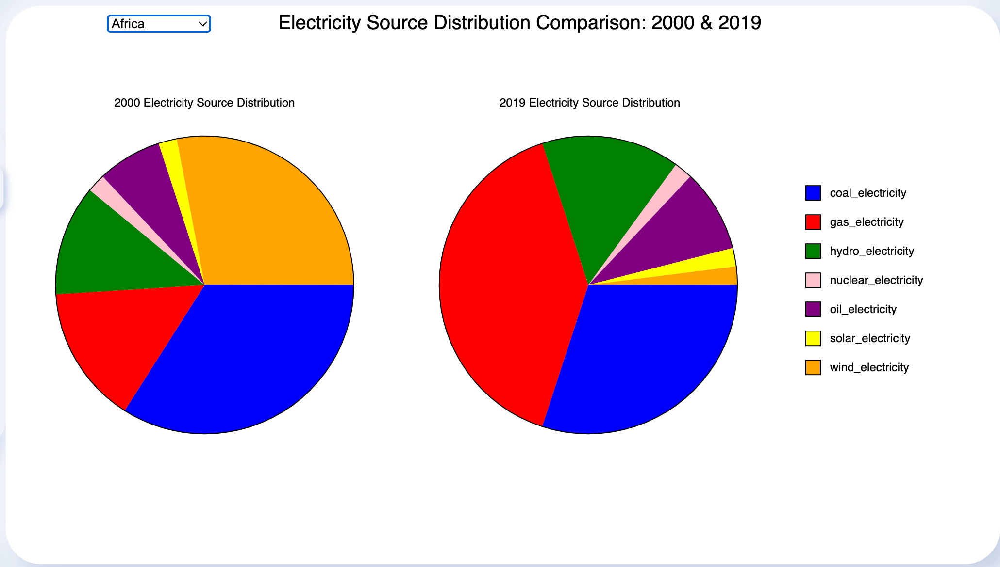
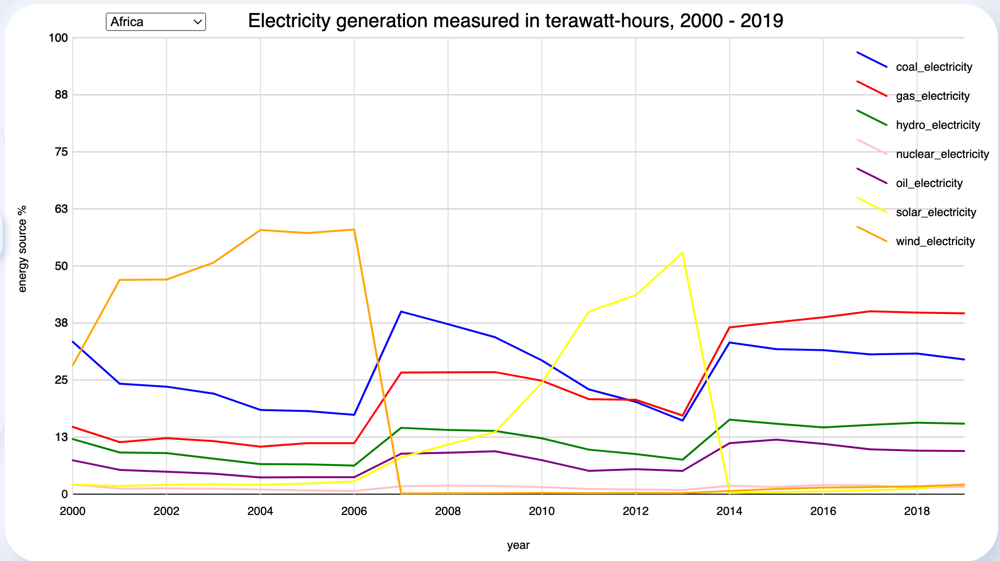
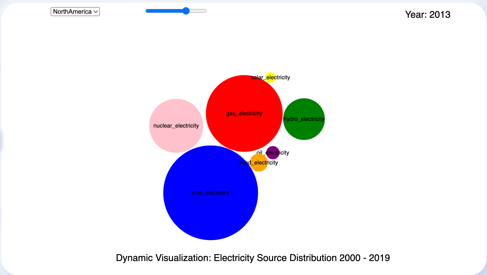
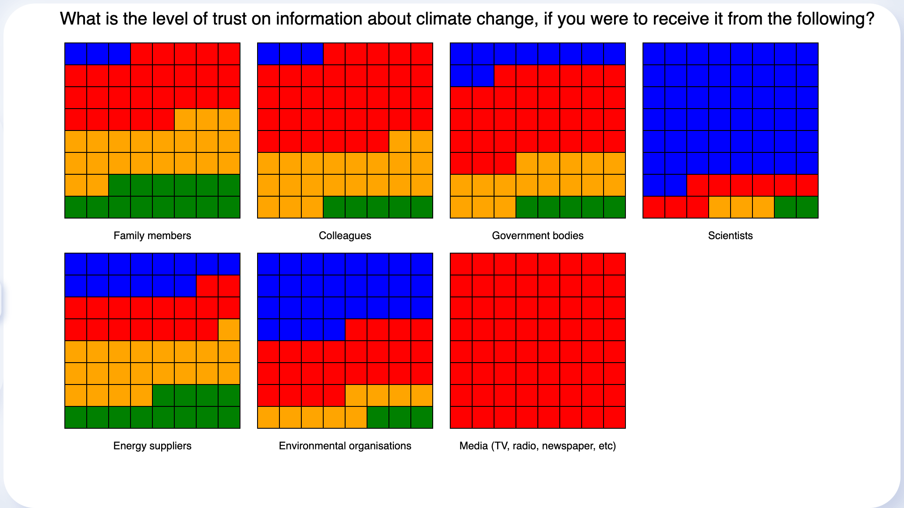
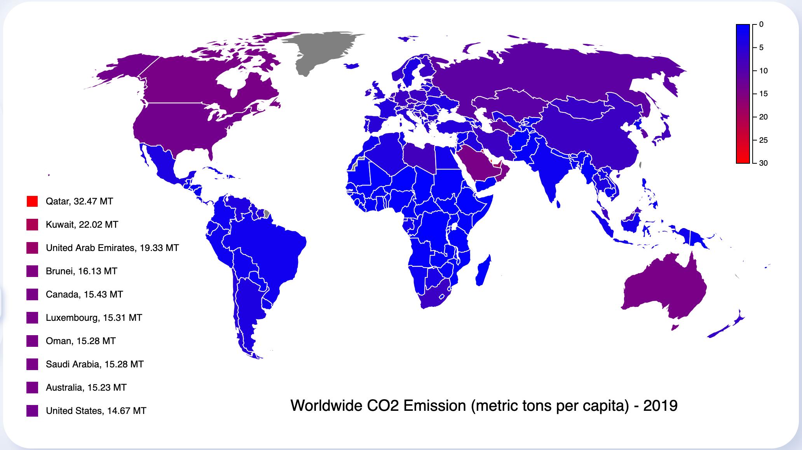

Certainly! Here's the full document with the integrated visualizations section:

---

# Web Data Visualization Project - University of London

This project focuses on visualizing data related to energy consumption, attitudes towards climate change, and CO2 emissions. It includes various visualizations to help users gain insights into these important environmental aspects.

## Project Structure

```
├── README.md
├── data
│   ├── energy-consumption
│   │   ├── World Energy Consumption.csv
│   │   ├── Year_2000.csv
│   │   ├── Year_2019.csv
│   │   └── time-series-dbs
│   │       ├── ElectricitySourceDistribution_Africa.csv
│   │       ├── ElectricitySourceDistribution_AsiaPacific.csv
│   │       ├── ElectricitySourceDistribution_Europe.csv
│   │       ├── ElectricitySourceDistribution_MiddleEast.csv
│   │       └── ElectricitySourceDistribution_NorthAmerica.csv
│   └── survey
│       └── attitudes-level-of-trust.csv
├── extensions
│   ├── attitudes-level-of-trust.js
│   ├── elect-distr-2000-2019.js
│   ├── elect-distr-bubble.js
│   ├── elect-source-distr.js
│   └── word-map-co2.js
├── images
│   ├── attitudes-level-of-trust.png
│   ├── dynamic-visualization.png
│   ├── electricity-source-distribution.png
│   ├── source-distribution-comparison.png
│   └── world-co2-emissions.png
├── index.html
├── lib
│   └── p5.min.js
├── modules
│   ├── bubble-chart.js
│   ├── gallery.js
│   ├── helper-functions.js
│   ├── pie-chart-comparison.js
│   ├── pie-chart.js
│   ├── waffle-box.js
│   └── waffle.js
├── sketch.js
└── style.css
```

## Visualizations

### Electricity Source Distribution Comparison: 2000 & 2019



The Source Distribution Comparison extension displays two pie charts, comparing the electricity generation from different sources in the years 2000 and 2019 for a selected country. It is based on the pie chart template for diversity race, modified to draw two pie charts.

### Electricity Source Distribution over the years 2000 to 2019



This extension provides a time series distribution of electricity generation from various sources between the years 2000 and 2019. Users can select data from five regions. Five different databases, one for each country, have been constructed with columns storing the time series data from 2000 to 2019 and rows storing the values for each energy source.

### Dynamic Visualization: Electricity Source Distribution 2000 - 2019



The Dynamic Visualization extension is based on the bubble chart visualization. It allows users to visualize the growth or shrinkage of each bubble, representing the energy generated from a source. The slider element enables users to slide through the years from 2000 to 2019.

### Survey: People's level of trust on information about Climate change



The Survey extension uses the waffle chart visualization to display the results of a survey question regarding the level of trust in information about climate change. Respondents provide a quantity-based answer.

### Worldwide CO2 emissions (metric tons per capita) - 2019



This extension displays CO2 emissions for each country in the world on a world map. The countries are colored based on the level of emissions, ranging from blue to red. Hovering over a country provides additional information about its CO2 emissions.

---

This document provides an overview of the project structure and the visualizations integrated into the system. Each visualization serves a unique purpose in presenting environmental data effectively.
